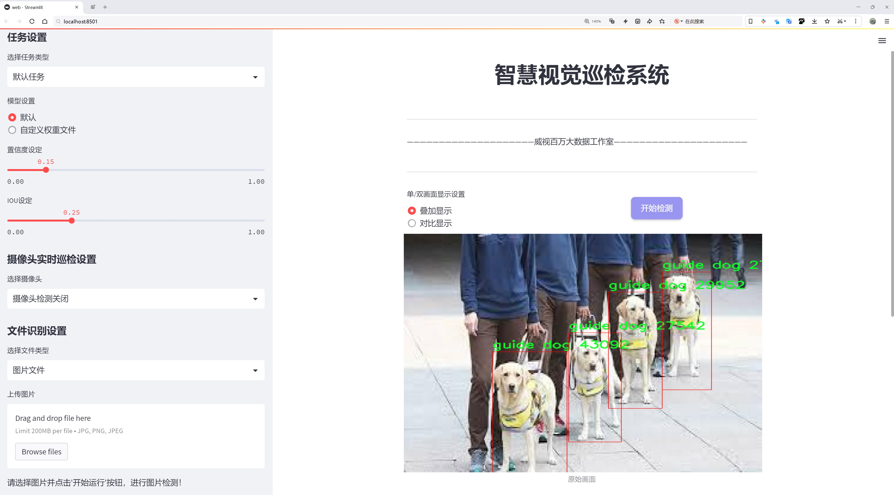
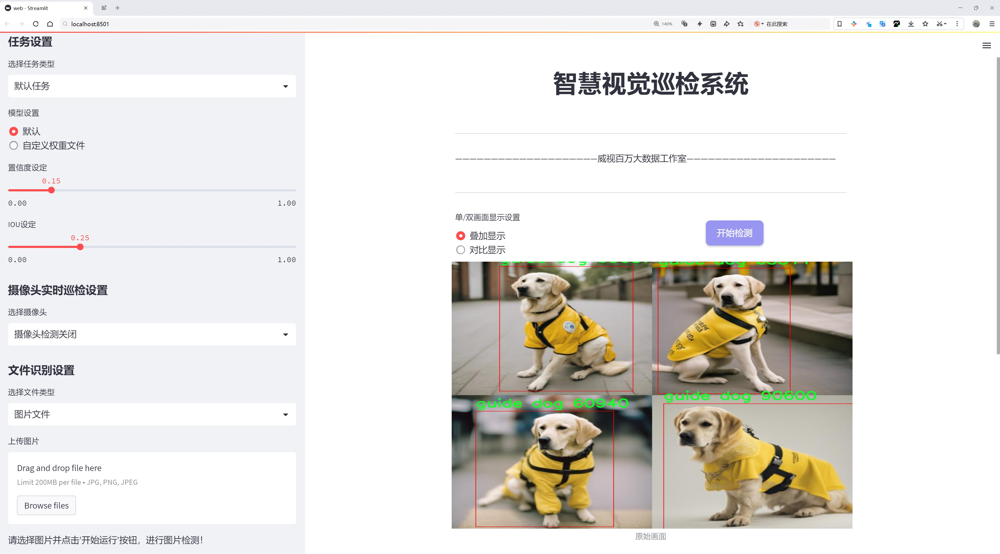
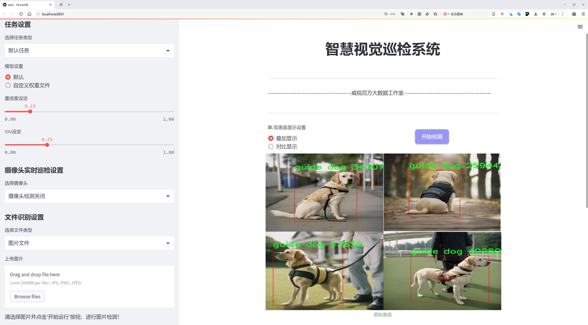
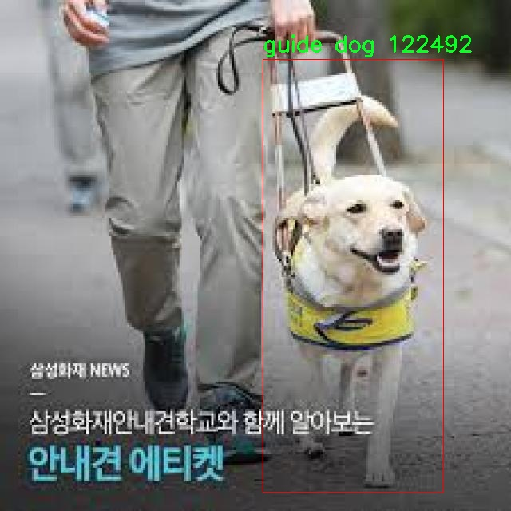
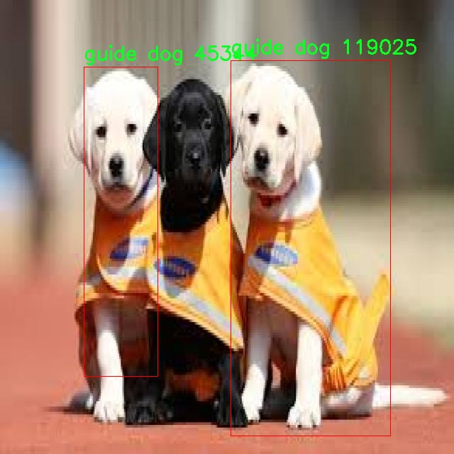
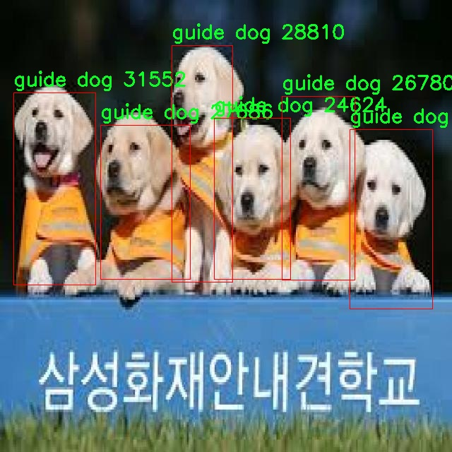
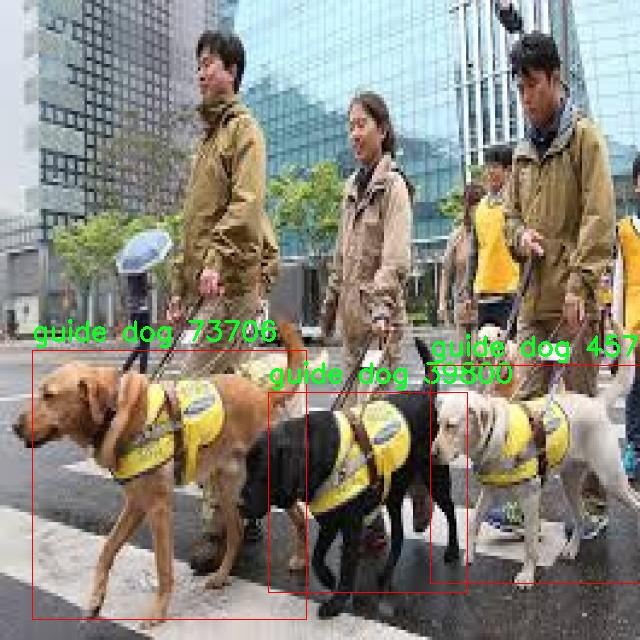
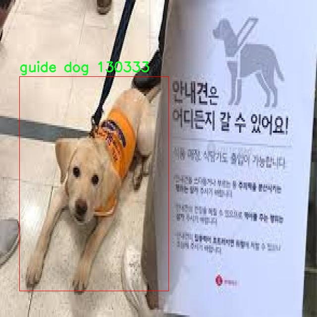

# 导盲犬辅助物体检测检测系统源码分享
 # [一条龙教学YOLOV8标注好的数据集一键训练_70+全套改进创新点发刊_Web前端展示]

### 1.研究背景与意义

项目参考[AAAI Association for the Advancement of Artificial Intelligence](https://gitee.com/qunshansj/projects)

项目来源[AACV Association for the Advancement of Computer Vision](https://gitee.com/qunmasj/projects)

研究背景与意义

随着社会的不断发展，残障人士的生活质量和社会参与度日益受到重视。特别是视觉障碍者，他们在日常生活中面临着诸多挑战，尤其是在物体识别和环境感知方面。导盲犬作为一种传统的辅助工具，虽然在一定程度上提高了视觉障碍者的独立性，但其训练成本高、依赖性强等问题使得其应用受到限制。因此，基于计算机视觉和深度学习技术的辅助物体检测系统应运而生，成为解决这一问题的重要方向。

在众多物体检测算法中，YOLO（You Only Look Once）系列因其高效性和实时性而备受关注。YOLOv8作为该系列的最新版本，进一步提升了检测精度和速度，适用于复杂环境下的物体识别任务。然而，针对视觉障碍者的特定需求，现有的YOLOv8模型仍存在一定的局限性，尤其是在导盲犬和白手杖等特定物体的检测精度和鲁棒性方面。因此，改进YOLOv8以适应导盲犬辅助物体检测系统的需求，具有重要的理论和实践意义。

本研究的核心在于构建一个基于改进YOLOv8的导盲犬辅助物体检测系统，旨在通过高效的物体检测技术，帮助视觉障碍者更好地识别周围环境中的重要物体。我们将使用一个包含4700张图像的数据集，该数据集专注于两类物体：导盲犬和白手杖。这两类物体不仅是视觉障碍者日常生活中最常见的辅助工具，也是他们与周围环境互动的重要媒介。通过对这两类物体的精准检测，系统能够实时提供环境信息，增强视觉障碍者的空间感知能力，从而提高他们的生活质量和独立性。

在研究过程中，我们将对YOLOv8进行多方面的改进，包括优化网络结构、调整损失函数、增强数据集等，以提高模型在特定场景下的检测性能。此外，我们还将探讨如何通过传感器融合技术，将物体检测与其他辅助技术（如语音提示、震动反馈等）相结合，形成一个多模态的辅助系统，进一步提升用户体验。

综上所述，基于改进YOLOv8的导盲犬辅助物体检测系统的研究，不仅具有重要的学术价值，还能为视觉障碍者提供切实的帮助，推动社会对残障人士的关注与支持。通过该系统的开发与应用，我们希望能够为视觉障碍者创造一个更加友好的生活环境，促进他们的社会参与和自我实现，最终实现技术与人文关怀的有机结合。

### 2.图片演示







##### 注意：由于此博客编辑较早，上面“2.图片演示”和“3.视频演示”展示的系统图片或者视频可能为老版本，新版本在老版本的基础上升级如下：（实际效果以升级的新版本为准）

  （1）适配了YOLOV8的“目标检测”模型和“实例分割”模型，通过加载相应的权重（.pt）文件即可自适应加载模型。

  （2）支持“图片识别”、“视频识别”、“摄像头实时识别”三种识别模式。

  （3）支持“图片识别”、“视频识别”、“摄像头实时识别”三种识别结果保存导出，解决手动导出（容易卡顿出现爆内存）存在的问题，识别完自动保存结果并导出到tempDir中。

  （4）支持Web前端系统中的标题、背景图等自定义修改，后面提供修改教程。

  另外本项目提供训练的数据集和训练教程,暂不提供权重文件（best.pt）,需要您按照教程进行训练后实现图片演示和Web前端界面演示的效果。

### 3.视频演示

[3.1 视频演示](https://www.bilibili.com/video/BV19M4EeeEqo/)

### 4.数据集信息展示

##### 4.1 本项目数据集详细数据（类别数＆类别名）

nc: 2
names: ['guide dog', 'whiteCane']


##### 4.2 本项目数据集信息介绍

数据集信息展示

在本研究中，我们采用了名为“blind man”的数据集，以支持对改进YOLOv8的导盲犬辅助物体检测系统的训练与评估。该数据集专注于两个主要类别的物体，这些类别对于提升盲人及视障人士的生活质量至关重要。具体而言，数据集中包含的类别为“导盲犬”（guide dog）和“白色手杖”（whiteCane），这两者在帮助视障人士导航和识别周围环境中扮演着不可或缺的角色。

数据集的构建旨在模拟真实世界中盲人及其导盲犬的互动场景，确保模型能够在多种环境下进行有效的物体检测。为了实现这一目标，数据集中的图像来源于不同的城市环境、室内场所以及自然景观，涵盖了多种光照条件和天气状况。这种多样性不仅增强了数据集的代表性，还为模型的训练提供了丰富的样本，确保其在实际应用中的鲁棒性。

在数据集的标注过程中，所有图像均经过专业人员的仔细审阅与标注，确保每个类别的物体都能被准确识别。导盲犬作为一种特定的犬种，其外观特征在不同的环境中可能会有所变化，因此数据集中包含了多种不同品种的导盲犬图像，以提高模型对这一类别的识别能力。同时，白色手杖作为视障人士的辅助工具，其设计和使用方式也可能因文化和地区的不同而有所差异，因此数据集中也包括了多种样式和使用场景的白色手杖图像。

数据集的规模经过精心设计，以确保其在训练过程中的有效性。尽管类别数量仅为两个，但每个类别的样本数量都经过精心选择，以便于模型能够学习到足够的特征信息。通过对导盲犬和白色手杖的不同姿态、角度和背景进行采集，数据集为YOLOv8模型提供了丰富的训练素材，帮助其在复杂的环境中进行准确的物体检测。

此外，为了评估模型的性能，数据集还划分为训练集、验证集和测试集。这样的划分不仅能够帮助研究人员监控模型在训练过程中的表现，还能确保最终模型在未见数据上的泛化能力。通过在不同的数据集上进行评估，研究人员能够更好地理解模型的优势与不足，从而进一步优化模型的架构和参数设置。

综上所述，“blind man”数据集的构建和应用为改进YOLOv8的导盲犬辅助物体检测系统提供了坚实的基础。通过对导盲犬和白色手杖的精准识别，研究旨在提升视障人士的生活质量，使他们在日常生活中能够更加自信地导航与探索周围的世界。数据集的多样性和丰富性为模型的训练提供了良好的支持，期待在未来的研究中，能够进一步推动这一领域的发展与应用。











### 5.全套项目环境部署视频教程（零基础手把手教学）

[5.1 环境部署教程链接（零基础手把手教学）](https://www.ixigua.com/7404473917358506534?logTag=c807d0cbc21c0ef59de5)


[5.2 安装Python虚拟环境创建和依赖库安装视频教程链接（零基础手把手教学）](https://www.ixigua.com/7404474678003106304?logTag=1f1041108cd1f708b01a)

### 6.手把手YOLOV8训练视频教程（零基础小白有手就能学会）

[6.1 手把手YOLOV8训练视频教程（零基础小白有手就能学会）](https://www.ixigua.com/7404477157818401292?logTag=d31a2dfd1983c9668658)

### 7.70+种全套YOLOV8创新点代码加载调参视频教程（一键加载写好的改进模型的配置文件）

[7.1 70+种全套YOLOV8创新点代码加载调参视频教程（一键加载写好的改进模型的配置文件）](https://www.ixigua.com/7404478314661806627?logTag=29066f8288e3f4eea3a4)

### 8.70+种全套YOLOV8创新点原理讲解（非科班也可以轻松写刊发刊，V10版本正在科研待更新）

由于篇幅限制，每个创新点的具体原理讲解就不一一展开，具体见下列网址中的创新点对应子项目的技术原理博客网址【Blog】：


[8.1 70+种全套YOLOV8创新点原理讲解链接](https://gitee.com/qunmasj/good)

### 9.系统功能展示（检测对象为举例，实际内容以本项目数据集为准）

图9.1.系统支持检测结果表格显示

  图9.2.系统支持置信度和IOU阈值手动调节

  图9.3.系统支持自定义加载权重文件best.pt(需要你通过步骤5中训练获得)

  图9.4.系统支持摄像头实时识别

  图9.5.系统支持图片识别

  图9.6.系统支持视频识别

  图9.7.系统支持识别结果文件自动保存

  图9.8.系统支持Excel导出检测结果数据


### 10.原始YOLOV8算法原理

原始YOLOv8算法原理

YOLOv8作为YOLO系列中的最新一员，于2023年1月10日正式发布，标志着计算机视觉领域的又一次重大进步。该模型在目标检测、实例分割和图像分类等任务中展现出卓越的性能，成为当前最先进的模型之一。YOLOv8不仅在精度上超越了其前辈YOLOv5、YOLOv6和YOLOX等模型，还在执行速度上表现出色，能够在多种硬件平台上高效运行。

YOLOv8的设计理念基于对YOLO系列模型的深入研究，充分吸收了前几代模型的优点，并在此基础上进行了全面的改进。其主要创新点包括新的骨干网络结构、Anchor-Free检测头和全新的损失函数。这些改进使得YOLOv8在处理小目标和高分辨率图像时表现得更加出色。

在数据预处理方面，YOLOv8延续了YOLOv5的策略，采用了多种数据增强技术，如马赛克增强、混合增强、空间扰动和颜色扰动等。这些增强手段有效地提高了模型的鲁棒性，使其在复杂背景下仍能保持较高的检测精度。

YOLOv8的骨干网络结构是其核心之一。与YOLOv5相比，YOLOv8对骨干网络进行了优化，采用了新的C2f模块替代了原有的C3模块。C2f模块通过增加更多的跳层连接和Split操作，增强了特征提取过程中的信息流动性和梯度回传的效率。这种结构的设计不仅提高了特征提取的精度，还使得模型在训练过程中能够更好地捕捉到细粒度的上下文信息。

在特征融合方面，YOLOv8继续采用FPN（特征金字塔网络）和PAN（路径聚合网络）结构。这种结构能够有效地融合多尺度信息，确保不同尺度的特征图能够相互补充，提升检测精度。YOLOv8在这一方面的改进主要体现在将C3模块替换为C2f模块，使得特征融合过程更加高效。

YOLOv8的检测头结构是其另一个重要创新。传统的YOLO系列模型采用耦合头结构，即通过一层卷积同时完成分类和定位任务。而YOLOv8则引入了解耦头结构，将分类和定位任务分开处理。这种解耦设计使得模型在进行目标检测时能够更好地优化分类和回归的性能，从而提升整体的检测效果。

在标签分配策略上，YOLOv8采用了动态标签分配策略，避免了依赖于数据集的候选框聚类方法。通过这种策略，YOLOv8能够更灵活地处理不同尺度的目标，确保正负样本的匹配更加准确。YOLOv8的损失函数设计也进行了创新，分类损失采用了Varifocal Loss，而回归损失则结合了CIoU Loss和DFL Loss。这种损失函数的设计不仅提高了模型的泛化能力，还增强了其对小目标的感知能力。

总的来说，YOLOv8在多个方面进行了创新和改进，使其在目标检测领域中表现出色。其骨干网络的优化、特征融合的高效性、解耦头的引入以及动态标签分配策略的应用，都是YOLOv8能够在复杂环境中实现高精度检测的关键因素。随着YOLOv8的推出，计算机视觉领域的研究者和工程师们将能够更好地应对各种实际应用中的挑战，推动智能视觉技术的进一步发展。


### 11.项目核心源码讲解（再也不用担心看不懂代码逻辑）

#### 11.1 70+种YOLOv8算法改进源码大全和调试加载训练教程（非必要）\ultralytics\utils\patches.py

以下是对代码的核心部分进行提炼和详细注释的结果：

```python
# Ultralytics YOLO 🚀, AGPL-3.0 license
"""对现有功能进行更新/扩展的猴子补丁。"""

from pathlib import Path
import cv2
import numpy as np
import torch

# OpenCV多语言友好的函数 ------------------------------------------------------------------------------
_imshow = cv2.imshow  # 复制以避免递归错误

def imread(filename: str, flags: int = cv2.IMREAD_COLOR) -> np.ndarray:
    """
    从文件中读取图像。

    参数:
        filename (str): 要读取的文件路径。
        flags (int, optional): 标志，可以取cv2.IMREAD_*的值。默认为cv2.IMREAD_COLOR。

    返回:
        np.ndarray: 读取的图像。
    """
    # 使用cv2.imdecode从文件中读取图像，支持多语言文件路径
    return cv2.imdecode(np.fromfile(filename, np.uint8), flags)

def imwrite(filename: str, img: np.ndarray, params=None) -> bool:
    """
    将图像写入文件。

    参数:
        filename (str): 要写入的文件路径。
        img (np.ndarray): 要写入的图像。
        params (list of ints, optional): 额外参数。参见OpenCV文档。

    返回:
        bool: 如果文件写入成功返回True，否则返回False。
    """
    try:
        # 使用cv2.imencode将图像编码并写入文件，支持多语言文件路径
        cv2.imencode(Path(filename).suffix, img, params)[1].tofile(filename)
        return True
    except Exception:
        return False

def imshow(winname: str, mat: np.ndarray):
    """
    在指定窗口中显示图像。

    参数:
        winname (str): 窗口名称。
        mat (np.ndarray): 要显示的图像。
    """
    # 使用cv2.imshow显示图像，处理窗口名称以支持Unicode
    _imshow(winname.encode('unicode_escape').decode(), mat)

# PyTorch函数 ----------------------------------------------------------------------------------------------------
_torch_save = torch.save  # 复制以避免递归错误

def torch_save(*args, **kwargs):
    """
    使用dill（如果存在）序列化lambda函数，以便pickle无法处理的情况。

    参数:
        *args (tuple): 传递给torch.save的位置参数。
        **kwargs (dict): 传递给torch.save的关键字参数。
    """
    try:
        import dill as pickle  # 尝试导入dill模块
    except ImportError:
        import pickle  # 如果没有dill，则使用pickle

    # 如果没有指定pickle模块，则使用导入的pickle
    if 'pickle_module' not in kwargs:
        kwargs['pickle_module'] = pickle  # noqa
    return _torch_save(*args, **kwargs)  # 调用原始torch.save函数
```

### 代码核心部分说明：
1. **imread**: 读取图像文件，支持多语言文件路径。
2. **imwrite**: 将图像写入文件，支持多语言文件路径。
3. **imshow**: 在窗口中显示图像，处理窗口名称以支持Unicode。
4. **torch_save**: 扩展了PyTorch的保存功能，支持序列化lambda函数。

这个文件是一个用于增强和扩展现有功能的“猴子补丁”文件，主要用于Ultralytics YOLO项目中的一些实用工具。它包含了一些对OpenCV和PyTorch库的功能进行封装和扩展的函数，以便于更好地处理图像和模型的保存。

首先，文件导入了必要的库，包括`Path`（用于处理文件路径）、`cv2`（OpenCV库，用于图像处理）、`numpy`（用于数值计算）和`torch`（PyTorch库，用于深度学习）。接着，文件中定义了一些函数。

`imread`函数用于从文件中读取图像。它接受文件名和读取标志作为参数，默认使用`cv2.IMREAD_COLOR`来读取彩色图像。函数内部使用`cv2.imdecode`和`np.fromfile`来读取图像数据，并返回一个NumPy数组。

`imwrite`函数用于将图像写入文件。它接受文件名、图像数据和可选的参数列表。函数使用`cv2.imencode`将图像编码，并通过`tofile`方法将其写入指定的文件。如果写入成功，返回`True`，否则返回`False`。

`imshow`函数用于在指定窗口中显示图像。它接受窗口名称和图像数据作为参数。为了避免递归错误，函数使用了一个内部的`_imshow`变量来调用`cv2.imshow`，并对窗口名称进行了编码处理，以确保支持多语言。

在PyTorch相关的部分，文件定义了一个`torch_save`函数，用于保存模型。这个函数尝试导入`dill`库（如果存在），因为`dill`可以序列化一些`lambda`函数，而`pickle`在这方面的能力有限。如果没有找到`dill`，则使用标准的`pickle`库。函数会将`pickle_module`参数添加到`kwargs`中，并调用原始的`torch.save`函数进行模型保存。

总的来说，这个文件通过对OpenCV和PyTorch的一些基本功能进行封装，提供了更灵活和多语言友好的图像处理和模型保存方法，增强了YOLO项目的实用性。

#### 11.2 ui.py

以下是代码中最核心的部分，并附上详细的中文注释：

```python
import sys
import subprocess

def run_script(script_path):
    """
    使用当前 Python 环境运行指定的脚本。

    Args:
        script_path (str): 要运行的脚本路径

    Returns:
        None
    """
    # 获取当前 Python 解释器的路径
    python_path = sys.executable

    # 构建运行命令，使用 streamlit 运行指定的脚本
    command = f'"{python_path}" -m streamlit run "{script_path}"'

    # 执行命令
    result = subprocess.run(command, shell=True)
    # 检查命令执行的返回码，若不为0则表示出错
    if result.returncode != 0:
        print("脚本运行出错。")

# 实例化并运行应用
if __name__ == "__main__":
    # 指定要运行的脚本路径
    script_path = "web.py"  # 这里可以替换为实际的脚本路径

    # 调用函数运行脚本
    run_script(script_path)
```

### 代码注释说明：
1. **导入模块**：
   - `sys`：用于访问与 Python 解释器紧密相关的变量和函数。
   - `subprocess`：用于生成新的进程、连接到它们的输入/输出/错误管道，并获得它们的返回码。

2. **定义 `run_script` 函数**：
   - 该函数接受一个参数 `script_path`，表示要运行的 Python 脚本的路径。
   - 使用 `sys.executable` 获取当前 Python 解释器的路径，以确保使用相同的环境来运行脚本。
   - 构建命令字符串，使用 `streamlit` 模块运行指定的脚本。
   - 使用 `subprocess.run` 执行构建的命令，并通过 `shell=True` 允许在 shell 中执行命令。
   - 检查命令的返回码，如果返回码不为0，表示脚本运行出错，打印错误信息。

3. **主程序入口**：
   - 使用 `if __name__ == "__main__":` 确保只有在直接运行该脚本时才会执行以下代码。
   - 指定要运行的脚本路径（在此示例中为 `web.py`）。
   - 调用 `run_script` 函数，传入脚本路径以执行该脚本。

这个程序文件名为 `ui.py`，其主要功能是使用当前的 Python 环境来运行一个指定的脚本。代码中首先导入了必要的模块，包括 `sys`、`os` 和 `subprocess`，以及一个自定义的模块 `QtFusion.path` 中的 `abs_path` 函数。

在 `run_script` 函数中，程序接受一个参数 `script_path`，这个参数是要运行的脚本的路径。函数内部首先获取当前 Python 解释器的路径，使用 `sys.executable`。接着，构建一个命令字符串，该命令用于调用 `streamlit` 来运行指定的脚本。命令的格式是 `"{python_path}" -m streamlit run "{script_path}"`，其中 `{python_path}` 和 `{script_path}` 分别被替换为当前 Python 解释器的路径和传入的脚本路径。

随后，程序使用 `subprocess.run` 方法来执行这个命令，`shell=True` 参数允许在 shell 中执行命令。执行完命令后，程序检查返回码 `result.returncode`，如果返回码不为 0，表示脚本运行过程中出现了错误，此时会打印出“脚本运行出错。”的提示信息。

在文件的最后部分，使用 `if __name__ == "__main__":` 来判断当前模块是否是主程序。如果是，则指定要运行的脚本路径，这里使用了 `abs_path("web.py")` 来获取 `web.py` 的绝对路径。最后，调用 `run_script` 函数来运行这个脚本。

总体来说，这个程序的作用是封装了一个运行 Python 脚本的功能，特别是用于运行 Streamlit 应用的脚本，提供了一种简便的方式来启动 Web 应用。

#### 11.3 70+种YOLOv8算法改进源码大全和调试加载训练教程（非必要）\ultralytics\models\sam\amg.py

以下是经过简化和注释的核心代码部分，主要功能是处理图像裁剪、掩码稳定性评分和边界框计算等。

```python
import math
import numpy as np
import torch
from itertools import product
from typing import List, Tuple

def is_box_near_crop_edge(boxes: torch.Tensor,
                          crop_box: List[int],
                          orig_box: List[int],
                          atol: float = 20.0) -> torch.Tensor:
    """
    检查给定的边界框是否接近裁剪边缘。
    
    参数:
    - boxes: 需要检查的边界框，格式为 (x0, y0, x1, y1)。
    - crop_box: 当前裁剪框的边界，格式为 [x0, y0, x1, y1]。
    - orig_box: 原始图像的边界框，格式为 [x0, y0, x1, y1]。
    - atol: 允许的绝对误差，默认为20.0。
    
    返回:
    - 一个布尔张量，指示哪些边界框接近裁剪边缘。
    """
    crop_box_torch = torch.as_tensor(crop_box, dtype=torch.float, device=boxes.device)
    orig_box_torch = torch.as_tensor(orig_box, dtype=torch.float, device=boxes.device)
    boxes = uncrop_boxes_xyxy(boxes, crop_box).float()  # 将裁剪框中的边界框转换为原始坐标
    near_crop_edge = torch.isclose(boxes, crop_box_torch[None, :], atol=atol, rtol=0)  # 检查是否接近裁剪边缘
    near_image_edge = torch.isclose(boxes, orig_box_torch[None, :], atol=atol, rtol=0)  # 检查是否接近原始图像边缘
    near_crop_edge = torch.logical_and(near_crop_edge, ~near_image_edge)  # 仅保留接近裁剪边缘的框
    return torch.any(near_crop_edge, dim=1)  # 返回是否有框接近裁剪边缘

def calculate_stability_score(masks: torch.Tensor, mask_threshold: float, threshold_offset: float) -> torch.Tensor:
    """
    计算一批掩码的稳定性评分。
    
    稳定性评分是通过阈值化预测掩码的 logits 计算的 IoU 值。
    
    参数:
    - masks: 预测的掩码张量。
    - mask_threshold: 掩码的阈值。
    - threshold_offset: 阈值偏移量。
    
    返回:
    - 稳定性评分的张量。
    """
    intersections = ((masks > (mask_threshold + threshold_offset)).sum(-1, dtype=torch.int16).sum(-1, dtype=torch.int32))
    unions = ((masks > (mask_threshold - threshold_offset)).sum(-1, dtype=torch.int16).sum(-1, dtype=torch.int32))
    return intersections / unions  # 返回 IoU 值作为稳定性评分

def generate_crop_boxes(im_size: Tuple[int, ...], n_layers: int, overlap_ratio: float) -> Tuple[List[List[int]], List[int]]:
    """
    生成不同大小的裁剪框列表。
    
    每一层的裁剪框数量为 (2**i)**2。
    
    参数:
    - im_size: 图像的尺寸 (高度, 宽度)。
    - n_layers: 裁剪层数。
    - overlap_ratio: 重叠比例。
    
    返回:
    - 裁剪框列表和对应的层索引列表。
    """
    crop_boxes, layer_idxs = [], []
    im_h, im_w = im_size
    short_side = min(im_h, im_w)

    # 添加原始图像的裁剪框
    crop_boxes.append([0, 0, im_w, im_h])
    layer_idxs.append(0)

    def crop_len(orig_len, n_crops, overlap):
        """计算裁剪框的长度。"""
        return int(math.ceil((overlap * (n_crops - 1) + orig_len) / n_crops))

    for i_layer in range(n_layers):
        n_crops_per_side = 2 ** (i_layer + 1)  # 每层的裁剪框数量
        overlap = int(overlap_ratio * short_side * (2 / n_crops_per_side))  # 计算重叠

        crop_w = crop_len(im_w, n_crops_per_side, overlap)  # 计算裁剪框宽度
        crop_h = crop_len(im_h, n_crops_per_side, overlap)  # 计算裁剪框高度

        crop_box_x0 = [int((crop_w - overlap) * i) for i in range(n_crops_per_side)]
        crop_box_y0 = [int((crop_h - overlap) * i) for i in range(n_crops_per_side)]

        # 生成裁剪框
        for x0, y0 in product(crop_box_x0, crop_box_y0):
            box = [x0, y0, min(x0 + crop_w, im_w), min(y0 + crop_h, im_h)]
            crop_boxes.append(box)
            layer_idxs.append(i_layer + 1)

    return crop_boxes, layer_idxs  # 返回裁剪框和层索引

def uncrop_boxes_xyxy(boxes: torch.Tensor, crop_box: List[int]) -> torch.Tensor:
    """
    将边界框从裁剪坐标转换为原始图像坐标。
    
    参数:
    - boxes: 裁剪后的边界框。
    - crop_box: 裁剪框的边界。
    
    返回:
    - 转换后的边界框。
    """
    x0, y0, _, _ = crop_box
    offset = torch.tensor([[x0, y0, x0, y0]], device=boxes.device)
    if len(boxes.shape) == 3:  # 检查是否有通道维度
        offset = offset.unsqueeze(1)
    return boxes + offset  # 添加偏移量以恢复原始坐标
```

以上代码包含了图像处理中的一些核心功能，注释详细解释了每个函数的作用和参数，便于理解和使用。

这个程序文件是一个与YOLOv8算法相关的Python代码，主要用于处理图像中的目标检测任务。代码中包含多个函数，主要功能包括边界框的处理、掩码的稳定性评分、生成裁剪框、以及对掩码进行后处理等。

首先，`is_box_near_crop_edge`函数用于判断给定的边界框是否接近裁剪边缘。它接收三个参数：边界框、裁剪框和原始框，通过计算这些框的接近程度，返回一个布尔张量，指示哪些框接近裁剪边缘。

接下来，`batch_iterator`函数用于从输入参数中生成批次数据，确保所有输入的长度相同，并根据指定的批次大小进行迭代。

`calculate_stability_score`函数计算一组掩码的稳定性评分。它通过计算在高低阈值下得到的二进制掩码的交并比（IoU）来评估掩码的稳定性。

`build_point_grid`和`build_all_layer_point_grids`函数用于生成均匀分布的二维点网格，适用于不同层次的裁剪框。这些网格可以用于后续的图像处理。

`generate_crop_boxes`函数生成不同大小的裁剪框。它根据图像的尺寸和层数，计算每一层的裁剪框，并返回这些框的列表。

`uncrop_boxes_xyxy`、`uncrop_points`和`uncrop_masks`函数用于将裁剪后的边界框、点和掩码还原到原始图像的坐标系中，确保后续处理能够正确地引用原始图像中的位置。

`remove_small_regions`函数使用OpenCV库来移除掩码中的小区域或孔洞，返回处理后的掩码和一个指示是否进行了修改的标志。

最后，`batched_mask_to_box`函数计算掩码周围的边界框，并返回这些框的坐标。它处理不同形状的输入，确保能够正确地输出边界框。

整体来看，这段代码实现了YOLOv8算法中与目标检测相关的多个重要功能，涉及图像裁剪、掩码处理和边界框计算等，能够为目标检测任务提供有效的支持。

#### 11.4 train.py

以下是经过简化和注释的核心代码部分：

```python
import random
import numpy as np
import torch.nn as nn
from ultralytics.data import build_dataloader, build_yolo_dataset
from ultralytics.engine.trainer import BaseTrainer
from ultralytics.models import yolo
from ultralytics.nn.tasks import DetectionModel
from ultralytics.utils import LOGGER, RANK
from ultralytics.utils.torch_utils import de_parallel, torch_distributed_zero_first

class DetectionTrainer(BaseTrainer):
    """
    扩展自 BaseTrainer 类，用于基于检测模型的训练。
    """

    def build_dataset(self, img_path, mode="train", batch=None):
        """
        构建 YOLO 数据集。

        参数:
            img_path (str): 包含图像的文件夹路径。
            mode (str): 模式，可以是 `train` 或 `val`，用户可以为每种模式自定义不同的增强。
            batch (int, optional): 批次大小，仅用于 `rect` 模式。默认为 None。
        """
        gs = max(int(de_parallel(self.model).stride.max() if self.model else 0), 32)
        return build_yolo_dataset(self.args, img_path, batch, self.data, mode=mode, rect=mode == "val", stride=gs)

    def get_dataloader(self, dataset_path, batch_size=16, rank=0, mode="train"):
        """构造并返回数据加载器。"""
        assert mode in ["train", "val"]
        with torch_distributed_zero_first(rank):  # 在 DDP 中仅初始化数据集 *.cache 一次
            dataset = self.build_dataset(dataset_path, mode, batch_size)
        shuffle = mode == "train"  # 训练模式下打乱数据
        workers = self.args.workers if mode == "train" else self.args.workers * 2
        return build_dataloader(dataset, batch_size, workers, shuffle, rank)  # 返回数据加载器

    def preprocess_batch(self, batch):
        """对一批图像进行预处理，包括缩放和转换为浮点数。"""
        batch["img"] = batch["img"].to(self.device, non_blocking=True).float() / 255  # 将图像转换为浮点数并归一化
        if self.args.multi_scale:  # 如果启用多尺度
            imgs = batch["img"]
            sz = (
                random.randrange(self.args.imgsz * 0.5, self.args.imgsz * 1.5 + self.stride)
                // self.stride
                * self.stride
            )  # 随机选择尺寸
            sf = sz / max(imgs.shape[2:])  # 计算缩放因子
            if sf != 1:
                ns = [
                    math.ceil(x * sf / self.stride) * self.stride for x in imgs.shape[2:]
                ]  # 计算新的形状
                imgs = nn.functional.interpolate(imgs, size=ns, mode="bilinear", align_corners=False)  # 进行插值
            batch["img"] = imgs
        return batch

    def set_model_attributes(self):
        """设置模型的属性，包括类别数量和名称。"""
        self.model.nc = self.data["nc"]  # 将类别数量附加到模型
        self.model.names = self.data["names"]  # 将类别名称附加到模型
        self.model.args = self.args  # 将超参数附加到模型

    def get_model(self, cfg=None, weights=None, verbose=True):
        """返回 YOLO 检测模型。"""
        model = DetectionModel(cfg, nc=self.data["nc"], verbose=verbose and RANK == -1)
        if weights:
            model.load(weights)  # 加载权重
        return model

    def plot_training_samples(self, batch, ni):
        """绘制带有注释的训练样本。"""
        plot_images(
            images=batch["img"],
            batch_idx=batch["batch_idx"],
            cls=batch["cls"].squeeze(-1),
            bboxes=batch["bboxes"],
            paths=batch["im_file"],
            fname=self.save_dir / f"train_batch{ni}.jpg",
            on_plot=self.on_plot,
        )
```

### 代码注释说明：
1. **导入必要的库**：引入了用于数据处理、模型构建和训练的相关库。
2. **DetectionTrainer 类**：继承自 `BaseTrainer`，用于实现 YOLO 模型的训练。
3. **build_dataset 方法**：构建 YOLO 数据集，支持训练和验证模式，能够根据不同模式应用不同的数据增强。
4. **get_dataloader 方法**：构造数据加载器，处理数据集的初始化和数据打乱。
5. **preprocess_batch 方法**：对输入的图像批次进行预处理，包括归一化和可能的多尺度调整。
6. **set_model_attributes 方法**：设置模型的类别数量和名称，确保模型能正确处理数据。
7. **get_model 方法**：返回一个 YOLO 检测模型，并可选择性地加载预训练权重。
8. **plot_training_samples 方法**：可视化训练样本及其注释，便于调试和结果分析。

这个程序文件 `train.py` 是一个用于训练 YOLO（You Only Look Once）目标检测模型的实现，基于 Ultralytics 提供的框架。程序的核心是 `DetectionTrainer` 类，它继承自 `BaseTrainer` 类，专门用于处理目标检测任务。

在这个类中，首先定义了 `build_dataset` 方法，用于构建 YOLO 数据集。该方法接收图像路径、模式（训练或验证）和批次大小作为参数，利用 `build_yolo_dataset` 函数来创建数据集，并根据模型的步幅调整图像大小。

接着，`get_dataloader` 方法用于构建数据加载器。它会根据传入的模式（训练或验证）初始化数据集，并根据需要设置是否打乱数据顺序。对于训练模式，加载器会随机打乱数据，而在验证模式下则不会。

`preprocess_batch` 方法负责对图像批次进行预处理，包括将图像缩放到合适的大小并转换为浮点数格式。这里使用了随机缩放的策略，以增强模型的鲁棒性。

`set_model_attributes` 方法用于设置模型的属性，包括类别数量和类别名称等。这些信息对于模型的训练和评估至关重要。

`get_model` 方法返回一个 YOLO 检测模型的实例，并可以加载预训练的权重。

`get_validator` 方法返回一个用于模型验证的 `DetectionValidator` 实例，便于在训练过程中评估模型的性能。

`label_loss_items` 方法用于返回一个包含训练损失项的字典，便于监控训练过程中的损失变化。

`progress_string` 方法生成一个格式化的字符串，用于显示训练进度，包括当前的轮次、GPU 内存使用情况、损失值、实例数量和图像大小等信息。

`plot_training_samples` 方法用于绘制训练样本及其标注，便于可视化训练过程中的数据。

最后，`plot_metrics` 和 `plot_training_labels` 方法分别用于绘制训练过程中的指标和标签，帮助用户分析模型的训练效果。

整体而言，这个文件提供了一个完整的训练流程，涵盖了数据加载、预处理、模型构建、训练监控和结果可视化等多个方面，旨在帮助用户高效地训练 YOLO 目标检测模型。

#### 11.5 70+种YOLOv8算法改进源码大全和调试加载训练教程（非必要）\ultralytics\utils\benchmarks.py

以下是代码中最核心的部分，并附上详细的中文注释：

```python
import time
import numpy as np
import pandas as pd
from ultralytics import YOLO
from ultralytics.utils import select_device, check_requirements, check_yolo

def benchmark(model='yolov8n.pt', imgsz=160, device='cpu', verbose=False):
    """
    对YOLO模型进行基准测试，评估不同格式的速度和准确性。

    参数:
        model (str): 模型文件的路径，默认为'yolov8n.pt'。
        imgsz (int): 基准测试时使用的图像大小，默认为160。
        device (str): 运行基准测试的设备，可以是'cpu'或'cuda'，默认为'cpu'。
        verbose (bool): 如果为True，将显示详细的基准测试信息，默认为False。

    返回:
        df (pandas.DataFrame): 包含每种格式的基准测试结果的数据框，包括文件大小、指标和推理时间。
    """
    
    # 选择设备（CPU或GPU）
    device = select_device(device, verbose=False)
    
    # 加载模型
    model = YOLO(model)

    results = []  # 存储每种格式的结果
    t0 = time.time()  # 记录开始时间

    # 遍历不同的导出格式
    for i, (name, format, suffix, cpu, gpu) in export_formats().iterrows():
        emoji, filename = '❌', None  # 默认导出状态为失败
        try:
            # 导出模型
            if format == '-':
                filename = model.ckpt_path or model.cfg  # PyTorch格式
            else:
                filename = model.export(imgsz=imgsz, format=format, device=device, verbose=False)
                exported_model = YOLO(filename)  # 加载导出的模型
            
            emoji = '✅'  # 导出成功

            # 进行推理
            exported_model.predict('path/to/sample/image.jpg', imgsz=imgsz, device=device)

            # 验证模型
            results = exported_model.val(data='path/to/dataset.yaml', batch=1, imgsz=imgsz, device=device)
            metric, speed = results.results_dict['mAP'], results.speed['inference']
            results.append([name, emoji, round(file_size(filename), 1), round(metric, 4), round(speed, 2)])
        except Exception as e:
            results.append([name, emoji, None, None, None])  # 记录失败的结果

    # 打印结果
    df = pd.DataFrame(results, columns=['Format', 'Status', 'Size (MB)', 'Metric', 'Inference time (ms/im)'])
    print(df)

    return df
```

### 代码说明
1. **导入必要的库**：导入了时间、NumPy、Pandas以及YOLO模型和一些工具函数。
2. **benchmark函数**：该函数用于对YOLO模型进行基准测试，评估其在不同格式下的速度和准确性。
   - **参数**：
     - `model`：指定要测试的模型文件路径。
     - `imgsz`：设置输入图像的大小。
     - `device`：指定运行测试的设备（CPU或GPU）。
     - `verbose`：控制是否输出详细信息。
3. **选择设备**：使用`select_device`函数选择合适的计算设备。
4. **加载模型**：通过YOLO类加载指定的模型。
5. **结果存储**：创建一个空列表`results`用于存储每种格式的测试结果。
6. **遍历导出格式**：使用`export_formats`函数遍历支持的模型导出格式。
   - **导出模型**：根据格式导出模型，并加载导出的模型。
   - **推理**：使用导出的模型进行推理，验证其功能。
   - **记录结果**：将每种格式的结果（包括状态、文件大小、指标和推理时间）添加到结果列表中。
7. **打印结果**：将结果转换为Pandas DataFrame并打印输出。

### 注意事项
- 代码中的`'path/to/sample/image.jpg'`和`'path/to/dataset.yaml'`需要替换为实际的图像和数据集路径。
- 该代码片段假设`export_formats`和`file_size`等函数已经定义并可用。

这个程序文件主要用于对YOLO模型进行基准测试，以评估其在不同格式下的速度和准确性。文件中包含了两个主要的类和一个函数，分别是`benchmark`函数和`ProfileModels`类。

`benchmark`函数的作用是对指定的YOLO模型进行基准测试。用户可以通过传入模型文件路径、数据集、图像大小、是否使用半精度或整型精度、设备类型（CPU或GPU）等参数来进行测试。函数会导出模型为不同的格式（如PyTorch、ONNX、TensorRT等），并对每种格式进行推理和验证，最终返回一个包含各格式基准测试结果的DataFrame，包括文件大小、指标和推理时间等信息。

在函数内部，首先会根据用户提供的参数选择设备，并加载模型。接着，程序会遍历所有支持的导出格式，进行模型导出和推理。每种格式的推理结果会被记录下来，包括模型的准确性和推理速度。如果导出或推理过程中出现错误，程序会记录错误信息并继续执行。最后，基准测试的结果会被打印出来，并保存到日志文件中。

`ProfileModels`类则用于对多个模型进行性能分析，特别是针对ONNX和TensorRT格式的模型。用户可以传入多个模型的路径，类会对每个模型进行基准测试，包括速度和FLOPs（每秒浮点运算次数）等参数。类中包含了多个方法，如获取文件、对TensorRT和ONNX模型进行分析、生成结果表格等。

在初始化时，用户可以设置多次运行的次数、预热运行的次数、最小测试时间、图像大小等参数。`profile`方法会执行模型的基准测试，并打印出结果。通过对不同模型的比较，用户可以更好地了解各个模型的性能表现。

总的来说，这个文件为YOLO模型的性能评估提供了一个全面的工具，支持多种模型格式，并能输出详细的基准测试结果，帮助用户选择合适的模型和配置。

#### 11.6 70+种YOLOv8算法改进源码大全和调试加载训练教程（非必要）\ultralytics\models\sam\modules\transformer.py

以下是代码中最核心的部分，并附上详细的中文注释：

```python
import math
import torch
from torch import Tensor, nn

class Attention(nn.Module):
    """注意力层，允许在投影到查询、键和值后对嵌入大小进行下采样。"""

    def __init__(self, embedding_dim: int, num_heads: int, downsample_rate: int = 1) -> None:
        """
        初始化注意力模型，设置嵌入维度和头数。

        Args:
            embedding_dim (int): 输入嵌入的维度。
            num_heads (int): 注意力头的数量。
            downsample_rate (int, optional): 内部维度下采样的因子，默认为1。
        """
        super().__init__()
        self.embedding_dim = embedding_dim
        self.internal_dim = embedding_dim // downsample_rate  # 计算内部维度
        self.num_heads = num_heads
        assert self.internal_dim % num_heads == 0, 'num_heads必须整除embedding_dim。'

        # 定义线性层用于查询、键和值的投影
        self.q_proj = nn.Linear(embedding_dim, self.internal_dim)
        self.k_proj = nn.Linear(embedding_dim, self.internal_dim)
        self.v_proj = nn.Linear(embedding_dim, self.internal_dim)
        self.out_proj = nn.Linear(self.internal_dim, embedding_dim)  # 输出投影层

    @staticmethod
    def _separate_heads(x: Tensor, num_heads: int) -> Tensor:
        """将输入张量分离成指定数量的注意力头。"""
        b, n, c = x.shape  # b: 批量大小, n: 序列长度, c: 嵌入维度
        x = x.reshape(b, n, num_heads, c // num_heads)  # 重塑为B x N x N_heads x C_per_head
        return x.transpose(1, 2)  # 转置为B x N_heads x N_tokens x C_per_head

    @staticmethod
    def _recombine_heads(x: Tensor) -> Tensor:
        """将分离的注意力头重新组合成一个张量。"""
        b, n_heads, n_tokens, c_per_head = x.shape
        x = x.transpose(1, 2)  # 转置为B x N_tokens x N_heads x C_per_head
        return x.reshape(b, n_tokens, n_heads * c_per_head)  # 重塑为B x N_tokens x C

    def forward(self, q: Tensor, k: Tensor, v: Tensor) -> Tensor:
        """计算给定输入查询、键和值张量的注意力输出。"""

        # 输入投影
        q = self.q_proj(q)  # 投影查询
        k = self.k_proj(k)  # 投影键
        v = self.v_proj(v)  # 投影值

        # 分离成多个头
        q = self._separate_heads(q, self.num_heads)
        k = self._separate_heads(k, self.num_heads)
        v = self._separate_heads(v, self.num_heads)

        # 计算注意力
        _, _, _, c_per_head = q.shape
        attn = q @ k.permute(0, 1, 3, 2)  # 计算注意力分数
        attn = attn / math.sqrt(c_per_head)  # 缩放
        attn = torch.softmax(attn, dim=-1)  # 应用softmax以获得权重

        # 获取输出
        out = attn @ v  # 计算加权和
        out = self._recombine_heads(out)  # 重新组合头
        return self.out_proj(out)  # 输出投影
```

### 代码说明：
1. **Attention类**：实现了一个注意力机制，可以处理输入的查询、键和值。支持多头注意力，并且可以选择是否对内部维度进行下采样。
2. **初始化方法**：设置嵌入维度、头数以及下采样率，并定义了用于查询、键和值的线性投影层。
3. **_separate_heads方法**：将输入张量分离成多个注意力头，便于并行计算。
4. **_recombine_heads方法**：将分离的注意力头重新组合成一个张量，以便进行后续处理。
5. **forward方法**：实现了注意力的前向传播，计算查询、键和值的投影，分离头，计算注意力权重，并返回最终的输出。

这个程序文件实现了一个名为 `TwoWayTransformer` 的双向变换器模块，主要用于处理图像和查询点之间的注意力机制。该模块特别适用于目标检测、图像分割和点云处理等任务。它的设计包括多个重要的组成部分和功能。

首先，`TwoWayTransformer` 类的构造函数接收多个参数，包括变换器的层数（`depth`）、输入嵌入的通道维度（`embedding_dim`）、多头注意力的头数（`num_heads`）、MLP块的内部通道维度（`mlp_dim`）以及激活函数等。构造函数中，使用 `nn.ModuleList` 创建了多个 `TwoWayAttentionBlock` 层，这些层将构成变换器的主体。

在 `forward` 方法中，输入的图像嵌入和位置编码被展平并重新排列，以便于后续的处理。查询点的嵌入被直接用作查询，而图像嵌入则作为键。接下来，逐层应用注意力块，处理查询和键的嵌入。最后，通过一个最终的注意力层将查询与图像进行交互，并进行层归一化处理。

`TwoWayAttentionBlock` 类实现了一个注意力块，包含自注意力和交叉注意力机制。它的构造函数定义了多个层，包括自注意力层、交叉注意力层、MLP块和归一化层。在 `forward` 方法中，首先对查询进行自注意力处理，然后将查询与图像嵌入进行交叉注意力处理，接着通过 MLP 块处理查询，最后再次进行交叉注意力处理，将图像嵌入与查询结合。

`Attention` 类则实现了一个标准的注意力机制，支持对嵌入进行降维处理。它的构造函数定义了输入嵌入的维度、注意力头的数量以及降维率。`forward` 方法中，输入的查询、键和值被分别投影到内部维度，并通过注意力机制计算输出。

总体而言，这个程序文件展示了如何通过双向注意力机制来增强图像和查询点之间的关系，从而提升模型在复杂视觉任务中的表现。

### 12.系统整体结构（节选）

### 整体功能和架构概括

该项目是一个基于YOLOv8算法的目标检测和图像处理框架，旨在提供高效的模型训练、推理和评估工具。项目的架构包含多个模块，每个模块负责特定的功能，如数据处理、模型训练、基准测试、图像变换和注意力机制等。通过这些模块的协同工作，用户可以方便地加载数据、训练模型、进行推理和评估性能。

### 文件功能整理表

| 文件路径                                                                                     | 功能描述                                                         |
|----------------------------------------------------------------------------------------------|------------------------------------------------------------------|
| `ultralytics/utils/patches.py`                                                              | 封装OpenCV和PyTorch的基本功能，提供图像读取、写入和模型保存方法。 |
| `ui.py`                                                                                      | 提供一个简单的接口来运行指定的Streamlit脚本。                     |
| `ultralytics/models/sam/amg.py`                                                             | 实现目标检测相关的功能，包括边界框处理、掩码稳定性评分和后处理。   |
| `train.py`                                                                                   | 定义YOLO模型的训练流程，包括数据加载、预处理、模型构建和监控。     |
| `ultralytics/utils/benchmarks.py`                                                           | 对YOLO模型进行基准测试，评估不同格式下的速度和准确性。             |
| `ultralytics/models/sam/modules/transformer.py`                                             | 实现双向变换器模块，处理图像和查询点之间的注意力机制。             |
| `ultralytics/models/yolo/detect/train.py`                                                   | 训练YOLO模型的具体实现，包含数据集构建和训练逻辑。                 |
| `ultralytics/utils/callbacks/dvc.py`                                                        | 提供与DVC（数据版本控制）相关的回调功能，便于模型训练的管理。       |
| `ultralytics/models/sam/modules/transformer.py`                                             | （重复）实现双向变换器模块，处理图像和查询点之间的注意力机制。     |
| `ultralytics/nn/modules/block.py`                                                            | 定义神经网络模块，提供基本的网络层和构建块。                       |
| `ultralytics/nn/backbone/revcol.py`                                                         | 实现反向卷积层，用于特征提取和网络构建。                           |
| `utils.py`                                                                                   | 提供通用的工具函数，支持项目中的各种操作。                         |
| `ultralytics/models/yolo/pose/val.py`                                                       | 进行YOLO模型的姿态估计验证，评估模型在姿态估计任务上的表现。       |

### 总结

该项目通过多个模块化的文件结构，提供了完整的目标检测解决方案，涵盖了从数据处理到模型训练、推理和评估的各个方面。每个文件都有其特定的功能，协同工作以实现高效的目标检测和图像处理。

注意：由于此博客编辑较早，上面“11.项目核心源码讲解（再也不用担心看不懂代码逻辑）”中部分代码可能会优化升级，仅供参考学习，完整“训练源码”、“Web前端界面”和“70+种创新点源码”以“13.完整训练+Web前端界面+70+种创新点源码、数据集获取”的内容为准。

### 13.完整训练+Web前端界面+70+种创新点源码、数据集获取


# [下载链接：https://mbd.pub/o/bread/ZpuUlJ1q](https://mbd.pub/o/bread/ZpuUlJ1q)